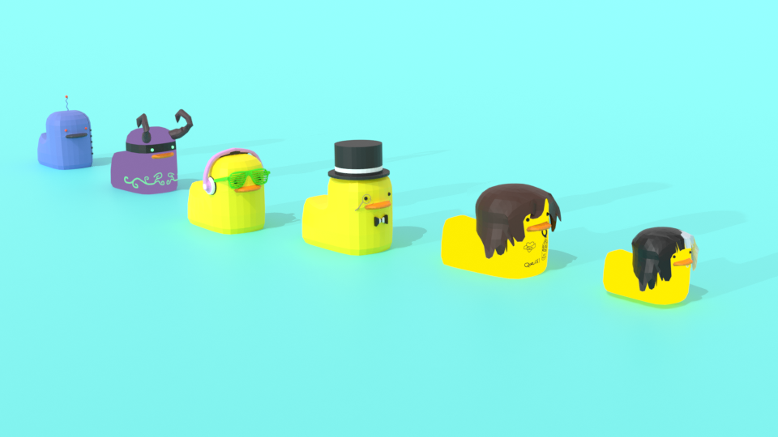

# My Portfolio: A 3D Adventure with THREE.js 

## Overview 

Welcome to my 3D portfolio! I built this interactive website using THREE.js, React, and Blender. Designed to be a unique reflection of my quirky style, the portfolio aims to stand out while showcasing my skills in 3D web development and Object-Oriented Programming (OOP).

## Features 

- **Interactive 3D Elements**: Navigate through an interactive pond full of floating ducks that reveal more about my projects when clicked.
- **Custom Shaders**: Enjoy realistic water ripples created using GLSL shaders.
- **Object-Oriented Design**: Ducks and other floatable elements are class objects, making it easy to add or modify components.

## Tech Stack 

- THREE.js
- React
- Blender
- GLSL Shaders
- AWS Amplify

## Challenges & Learnings 📚

The most challenging part of this project was crafting a unique 3D portfolio that effectively showcases both my skills and personality. It was a fantastic opportunity to deepen my understanding of 3D web development, particularly with THREE.js and Blender.

## Live Demo 🌐

You can check out the live portfolio [here](www.joshgreen.tech).
